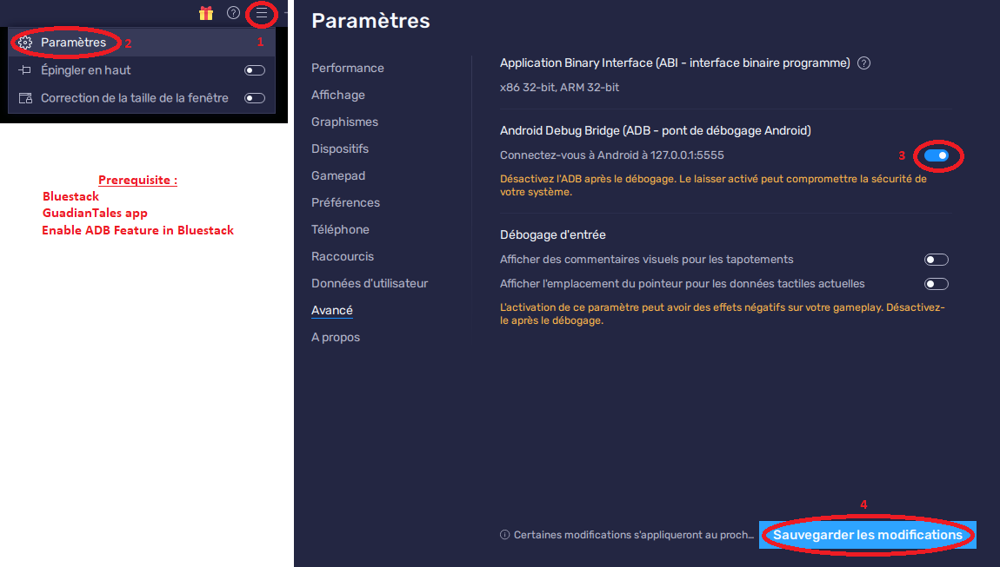

<p align="center"><a href=https://github.com/leghort/GuardianTalesBot/releases></p>

> GuadiantTalesBot restart you crashed GuardianTales powered by BlueStacks automatically

## What is that ?
On Windows Guadiant Tales powered by BlueStacks regularly crash<br />
GuardianTalesBot restarts BlueStacks automatically after a crash.<br />

<div align="center">
<a href=https://github.com/leghort/GuardianTalesBot/releases/latest></a>
</div>

## Requirements
- GuadianTales app powered by BlueStacks
- ADB in BlueStacks enabled
<div align="center">

</div>

## Python source code
```python
git clone https://github.com/leghort/script
cd source
pip3 install -r requirements.txt
```